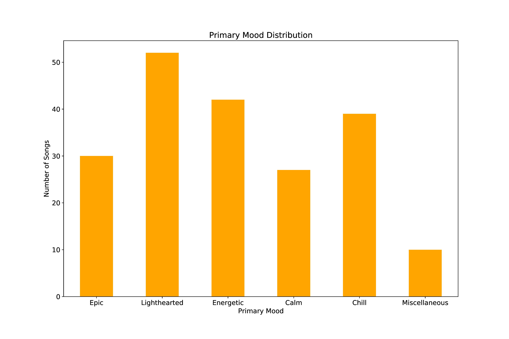
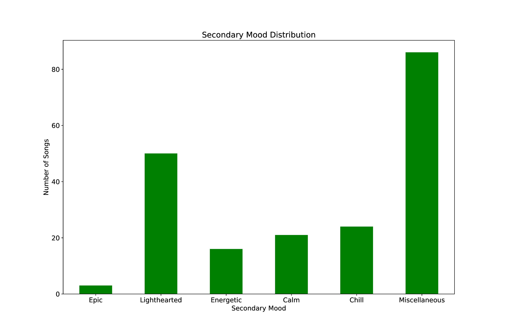
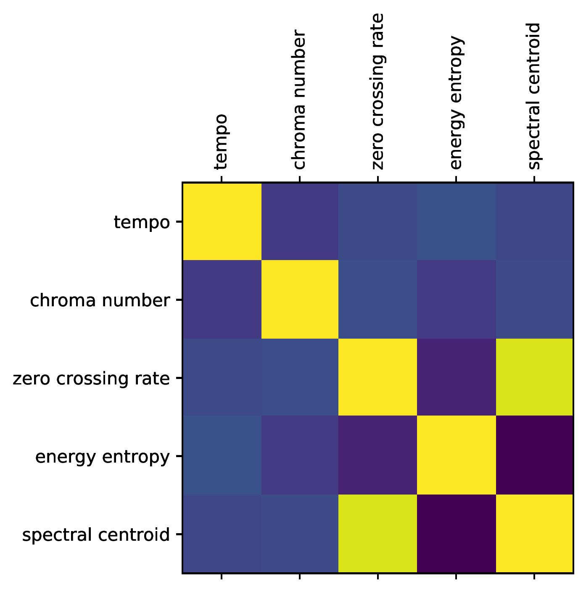

# Data Overview

Last Updated: February 3, 2021
### Primary Mood Distribution
This is the distribution of primary moods:  

### Secondary Mood Distribution
This is the distribution of secondary moods:  

### Top Ten Artists
Here are the top ten most frequent artists (with number of songs):  
Takanashi Yasuharu     **18**  
One Direction          **13**  
Super Junior           **12**  
Two Steps From Hell    **10**  
Sereno                  **7**  
Taylor Swift            **5**  
Yamagami Takeshi        **4**  
Yiruma                  **4**  
VK                      **4**  
Toshiro Masuda          **3**  

### Correlation Matrix of 5 Features
This is the correlation matrix of the five features extracted from the mp3 files:  
