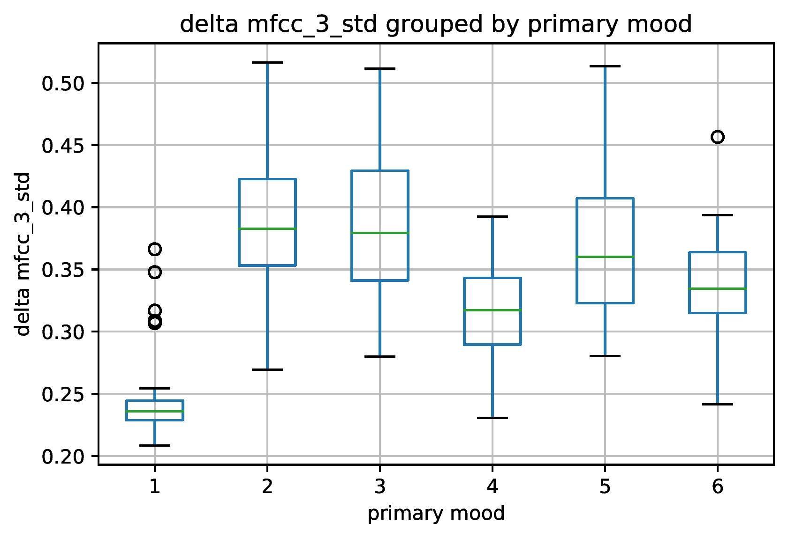

# Data Overview

Last Updated: May 7, 2021

This document contains some general information about the data used for training the models.
A total of 200 MP3 files were labeled with a primary mood and a secondary mood for the supervised 
learning algorithms. Here are some statistics about the songs and their features:

### Primary Mood Distribution
This is the distribution of primary moods:  

### Secondary Mood Distribution
This is the distribution of secondary moods:  

### Top Ten Artists
Here are the top ten most frequent artists (with number of songs included):  
<pre>
Takanashi Yasuharu          <b>18</b>  
One Direction               <b>13</b>  
Super Junior                <b>12</b>  
Two Steps From Hell         <b>10</b>  
Sereno                      <b>07</b>  
Taylor Swift                <b>05</b>  
Yamagami Takeshi            <b>04</b>  
Yiruma                      <b>04</b>  
VK                          <b>04</b>  
Toshiro Masuda              <b>03</b>  
</pre>

### Correlation Matrix of 5 Basic Features
One set of features are referred to as the [basic features](features.csv). The basic features only include
the tempo, chroma number, zero crossing rate, energy entropy, and spectral centroid of each MP3 file.
This is the correlation matrix of the five basic features for all 200 MP3 files:  

### Correlation Matrix of 28 Engineered Features
One set of features are referred to as the [engineered features](engineered_features.csv). The data distributions
of all features extracted using the package pyAudioAnalysis were analyzed to choose the features with greatest 
variation among primary moods. This is the correlation matrix of the 28 chosen/engineered features for all 200 MP3 files:  

### Data Distribution Plots of Engineered Features
Here are the data distributions as separated by primary mood for each of the 28 engineered features:

#### Tempo

#### Chroma Number

#### Zero Crossing Rate Mean

#### Zero Crossing Rate Standard Deviation

#### Energy Mean

#### Energy Entropy Mean

#### Spectral Centroid Mean

#### Spectral Spread Mean

#### Spectral Entropy Mean

#### Mel-Frequency Cepstrum Coefficient 2 Mean

#### Mel-Frequency Cepstrum Coefficient 5 Mean

#### Mel-Frequency Cepstrum Coefficient 6 Mean

#### Spectral Centroid Standard Deviation

#### Spectral Entropy Standard Deviation

#### Spectral Spread Standard Deviation

#### Chroma 7 Standard Deviation

#### Delta Chroma 2 Standard Deviation

#### Delta Chroma 3 Standard Deviation

#### Delta Chroma 9 Standard Deviation

#### Delta Chroma Standard Deviation's Standard Deviation

#### Delta Energy Standard Deviation

#### Delta Mel-Frequency Cepstrum Coefficient 1 Standard Deviation

#### Delta Mel-Frequency Cepstrum Coefficient 3 Standard Deviation

#### Delta Mel-Frequency Cepstrum Coefficient 13 Standard Deviation

#### Delta Spectral Centroid Standard Deviation

#### Delta Spectral Entropy Standard Deviation

#### Delta Spectral Flux Standard Deviation

#### Delta Spectral Spread Standard Deviation
