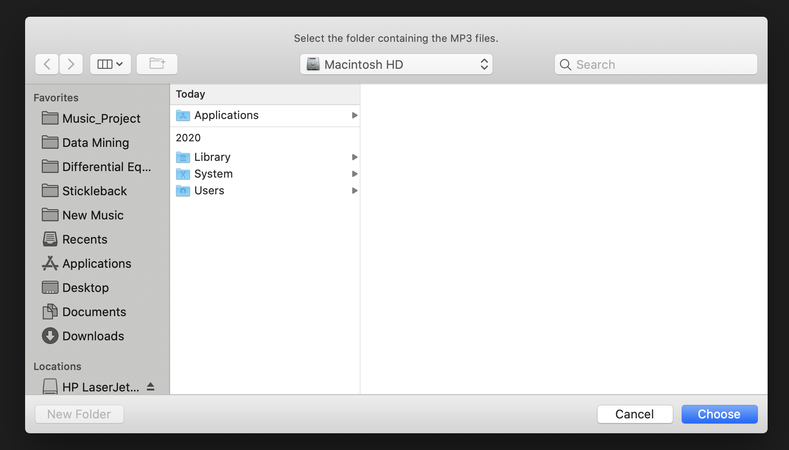
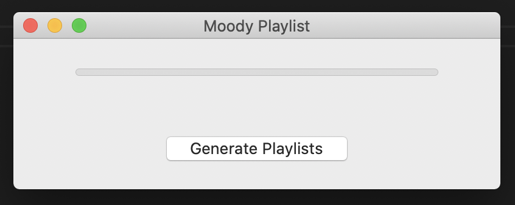
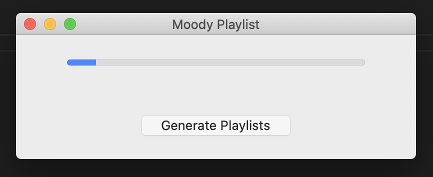
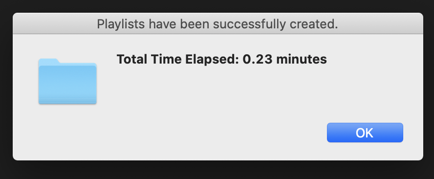

# How to Use Moody Playlist (Tutorial/Setup)

Last Updated: May 7, 2021
### Environment Setup
Environment setup must be completed to run the application or edit the existing code.
1. Download and install [Anaconda](https://docs.anaconda.com/anaconda/install/)  
    - If you aren't already using Python 3.8 with Anaconda, run the following commands  
        ```bash
        conda activate
        conda install -c anaconda python=3.8
        ```
2. Create and switch to an environment named music
    ```bash
    conda create --name music python=3.8
    conda activate music
    ```
3. Install the two packages needed: librosa and pyAudioAnalysis
    - [librosa](https://librosa.org/) installation
        ```bash
        conda install -c conda-forge librosa
        ```
    - [pyAudioAnalysis](https://github.com/tyiannak/pyAudioAnalysis/) installation
        ```bash
        git clone https://github.com/tyiannak/pyAudioAnalysis.git
        pip install -r pyAudioAnalysis/requirements.txt
        pip install -e pyAudioAnalysis/
        ```
4. Install packages in [requirements.txt](requirements.txt)
    ```bash
    conda install --file requirements.txt
    ```

### Using the Application
All environment setup steps are required for the application to run properly.
1. Download the [application](application) folder and its contents
    - The three files required for the program to run are [mood_mlp_model.sav](application/mood_mlp_model.sav), 
    [mood_stacking_model.sav](application/mood_stacking_model.sav), and [moody_playlist.py](application/moody_playlist.py)
2. Start up the Anaconda environment **music** inside the application folder
    ```bash
    cd application
    conda activate music
    ```
3. Run the file [moody_playlist.py](application/moody_playlist.py) with the following command
    ```bash
    python3 moody_playlist.py
    ```
4. Wait a few minutes while the packages and modules load
5. Shortly, a window will pop up prompting you to choose the folder containing the MP3 files
    - This folder and its subfolders should contain all of the MP3 files you wish to analyze
    - The playlist files will also be written to this folder

6. After choosing the directory, a message box with a button will pop up
    - Click the **Generate Playlists** button to start running the application

7. While the application is generating playlists, the following progress bar will appear

8. When the application is done running, the following message box will pop up
    - Time elapsed will depend on how many files were analyzed and the structure of the chosen directory
    - The amount of time needed per MP3 file is approximately 15 to 20 seconds
    - Click **OK** to exit the application


### Application Caveats
*These caveats are created by the fact that the playlist files are written using relative paths to the MP3 files.*
1. The playlist files generated are in M3U format, which can be read by most media players on PC and mobile, but there 
are exceptions.
2. The playlists are written assuming your folder structure does not change. Moving existing MP3 files to different 
folders and renaming existing folders will break the playlist files and require you to regenerate playlists by running
the application again.
3. The playlist files must be kept in the same folder that they are generated in. Moving the M3U files will render the
playlist files useless.